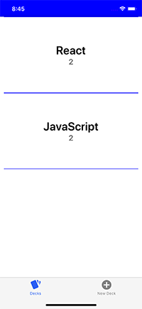
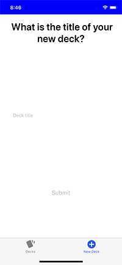
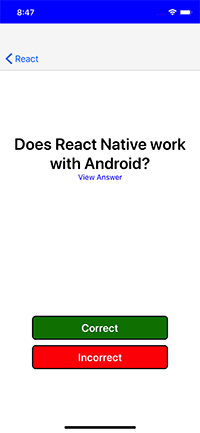

# Udacicards Project

This is my submission for the project Udacicards from Udacity's React Developer Nanodegree. In this project a mobile applicationis built which  allows users to study collections of flashcards. The app allows users to create different categories of flashcards called "decks", add flashcards to those decks, then take quizzes on those decks.

## Starting the application

In order to run the mobile application check out this repository

```
bash$ git clone https://github.com/mentlsve/reactnd-project-udacicards.git
bash$ cd reactnd-project-udacicards
bash$ yarn start
```

The app has been tested on the iOS Simulator (iPhone X 11.2) and on an Android device (Redmi 4X). After launching the app you should see the deck overview screen (see below).

## Main screens

### Deck overview



### Deck details


### Create new deck


### Take quiz


### Add question
